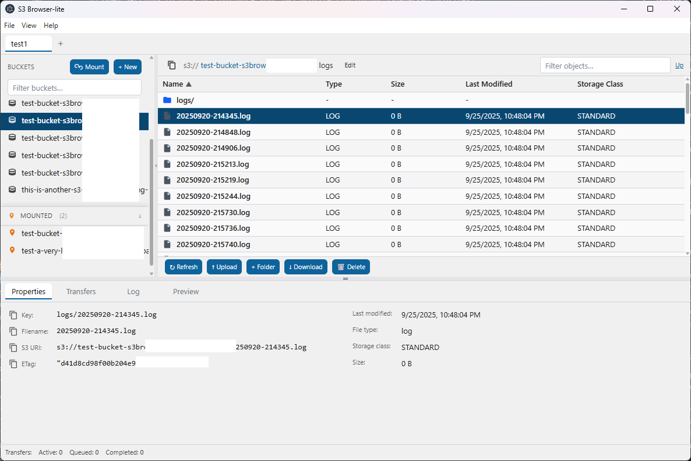

# S3 Browser-lite

Lightweight desktop app for browsing, downloading, and uploading Amazon S3 content. Runs on Windows today; macOS builds are planned.

## Key features

- Browse buckets and prefixes with fast, paginated listings
- Object preview: fetches the first chunk, auto-detects text vs binary, shows inline text when possible
- Transfer queue with progress and ETA: download single objects or whole folders; upload files and directories
- Efficient transfers: multipart upload/download, concurrent parts/objects, and resume via on-disk manifests
- Create and delete: buckets, folders (prefix markers), single objects, or whole folders recursively
- Export object lists to CSV for analysis or sharing
- Profiles and AWS files: detect profiles from ~/.aws, optionally view/edit credentials and config from Settings
- Requester Pays, bandwidth throttling, and concurrency controls
- Persistent settings per user and detailed logging with adjustable levels

## Download and install

- Windows installers (NSIS .exe / MSI .msi): https://github.com/cornibe/s3lite-browser/releases
- macOS: coming soon

If there are no Releases yet, you can build from source (see Build from source below).

## Quick start

1) Install and launch S3 Browser-lite.
2) Open Settings to pick or configure your AWS profile (including SSO-backed profiles).
3) Select a profile, choose a bucket from the sidebar, and start browsing.

Tips
- Paste an S3 path (for example, s3://my-bucket/path) into the header to jump directly there. The app validates access and reverts if invalid.
- Logs are accessible from the menu: View → Open Logs Folder (see Logs below).

## Screenshot



## Build from source

Requirements: Node.js 18+ and npm

Dev run (hot reload renderer + Electron):

```bash
cd app
npm install
npm run dev
```

Make distributables (Electron Forge):

```bash
cd app
npm run make
```

Windows installers (electron-builder):

```bash
cd app
npm install
npm run build:win
```

Notes
- Outputs are written to `app/dist/` locally.
- Binaries are currently unsigned; Windows SmartScreen may warn on first run.

## Logs

The app writes human-readable text logs to an OS‑native location. One line per event includes time, level, process, pid, sessionId, scope, and key–value metadata.

Locations

- Windows: %LOCALAPPDATA%\S3 Browser-lite\Logs\
- macOS: ~/Library/Logs/S3 Browser-lite/
- Linux: $XDG_STATE_HOME/s3-browser-lite/logs/ or ~/.local/state/s3-browser-lite/logs/, fallback ~/.cache/s3-browser-lite/logs/

File naming: s3-browser-lite-YYYYMMDD.log (rotated at 10 MB with .1/.2/.3).

Levels: TRACE, DEBUG, INFO, WARN, ERROR, FATAL.

Defaults: DEBUG in dev; INFO in production. Override with env S3B_LOG_LEVEL or CLI flag --log-level=LEVEL. CLI wins over env.

At runtime, open View → Logging to change the level or open the logs folder.

To collect logs for support

1. Set S3B_LOG_LEVEL=trace and restart the app, or change via menu.
2. Reproduce the issue.
3. Use View → Open Logs Folder and attach the latest s3-browser-lite-YYYYMMDD.log files.

## Project structure

See [AGENTS.md](./AGENTS.md) for structure and best practices.
